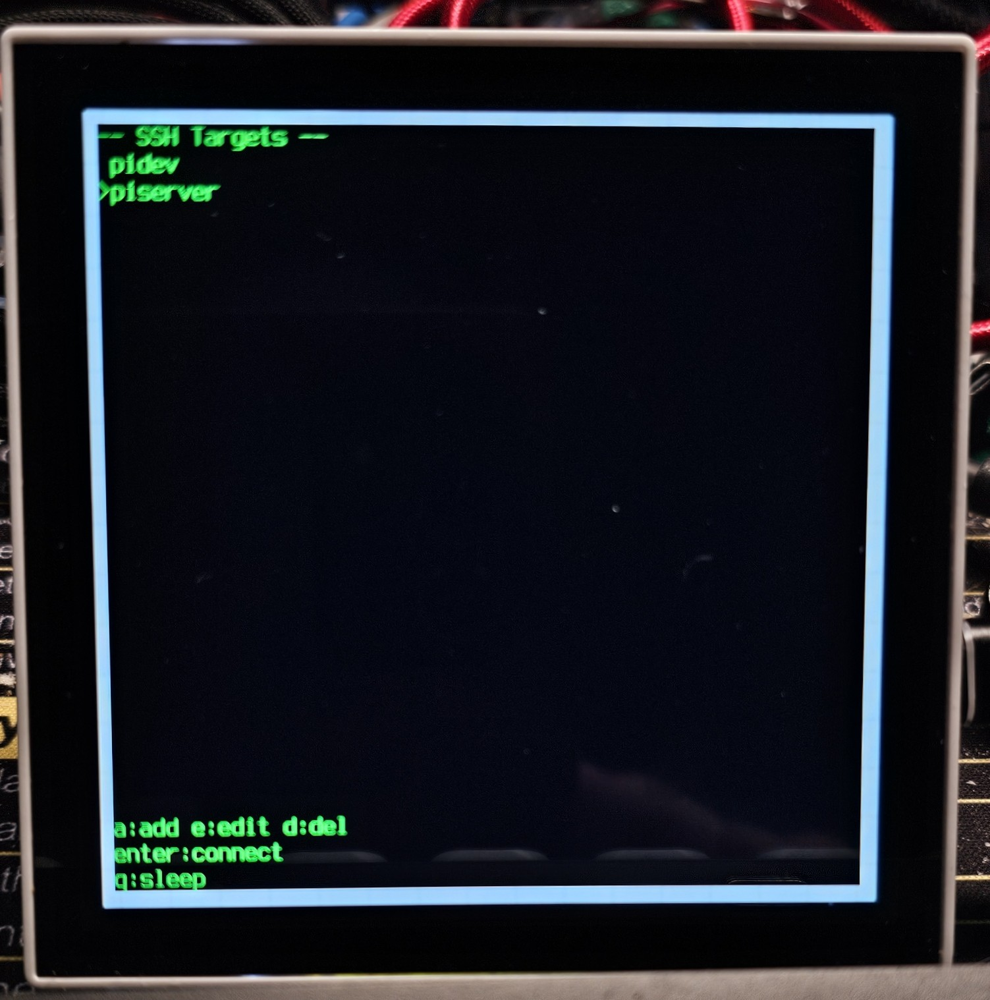
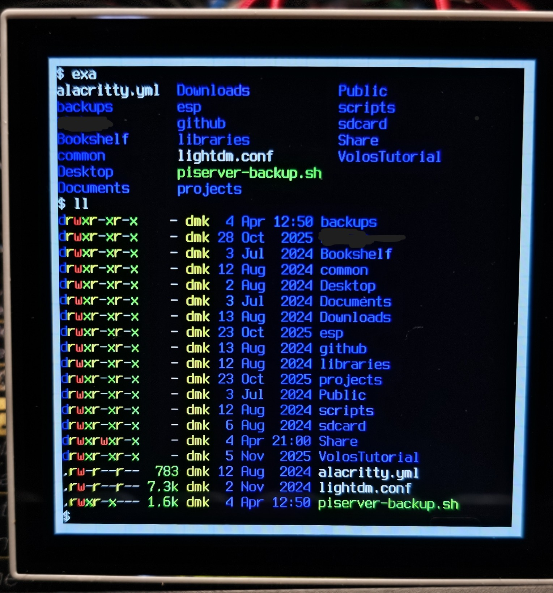

# esp32-terminal

SSH terminal on ESP32-P4 with BLE keyboard, MIPI-DSI display, and ESP32-C6 co-processor (WiFi + BT via esp_hosted).

> For chip-level notes on the P4+C6 combination (esp_hosted init, SDIO, PSRAM, errata, etc.) see [esp32-notes](https://github.com/dmatking/esp32-notes).

## Screenshots

| Waveshare Menu | Waveshare Terminal |
|----------------|---------------------|
|  |  |

## Supported Boards

| Board | Display | Resolution | Terminal Grid |
|-------|---------|------------|---------------|
| ESP32-P4 Function EV Board | EK79007 | 1024x600 | 83x24 |
| Waveshare ESP32-P4-WIFI6-Touch-LCD-4B | ST7703 | 720x720 | 58x29 |

## Board Selection

Board selection is done via `idf.py menuconfig` under **"Terminal P4 Configuration" > "Target board"**.

Alternatively, set directly in `sdkconfig`:

```
# ESP32-P4 Function EV Board (default)
CONFIG_BOARD_P4_EV=y

# Waveshare 720x720
CONFIG_BOARD_P4_WAVESHARE=y
```

After changing the board, do a full clean rebuild:

```bash
idf.py fullclean
idf.py build
```

**Note:** `fullclean` removes `managed_components/` which get re-downloaded on next build. The `sdkconfig` is preserved.

## Waveshare C6 Firmware

The Waveshare board ships with old C6 co-processor firmware (v0.0.0) that doesn't support BT. On first boot, the app OTAs the C6 to v2.12.3 from the `slave_fw` partition. This partition must be flashed separately once:

```bash
esptool.py --chip esp32p4 -p /dev/ttyACM0 write_flash --force 0x310000 slave_fw/network_adapter.bin
```

After that, `idf.py flash` handles the app partition and the OTA is automatic.

## BLE Keyboard Pairing

- On first boot (no bonds), scanning starts automatically
- On subsequent boots, reconnects to the bonded keyboard
- To force re-pair: hold BOOT button for 2 seconds while "reconnecting..." is displayed

## Build & Flash

```bash
source /path/to/esp-idf/export.sh
idf.py build
idf.py -p /dev/ttyACM0 flash monitor
```
